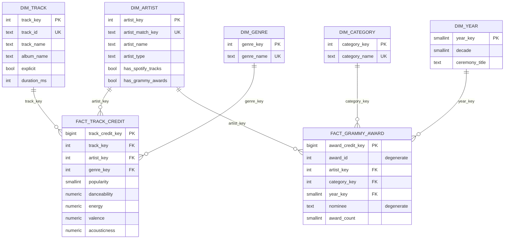

# Workshop 2: Building a Reliable Batch Data Pipeline

**Asignatura:** ETL - Ingeniería de Datos e Inteligencia Artificial (2026-2)  
**Institución:** Universidad Autónoma de Occidente (UAO)  
**Stack tecnológico:** Python 3.12, PostgreSQL 16, Apache Airflow 3.1.8, Great Expectations 1.23.x, Docker & Docker Compose.

---

## 1. Problema y Objetivo Analítico
El objetivo de este proyecto académico es diseñar y construir un pipeline de datos batch confiable, resiliente e idempotente[cite: 19]. Este pipeline integra dos fuentes de datos heterogéneas (un archivo CSV del catálogo de Spotify y una base de datos relacional de los premios Grammy)[cite: 19] para alimentar un Data Warehouse analítico con modelo en estrella en PostgreSQL (`music_dw`)[cite: 19]. La meta principal es responder a preguntas de negocio sobre la relación entre el reconocimiento en los premios Grammy y la popularidad o características acústicas de las pistas en Spotify[cite: 19].

## 2. Requerimientos Analíticos (R1, R2, R3)
El pipeline fue diseñado para soportar los siguientes requerimientos, los cuales demandan información combinada de ambas fuentes[cite: 22]:

| ID | Requerimiento Analítico | Required Data (Attributo -> Fuente) | Fuentes de Datos | KPIs Esperados | Nivel de Detalle |
|---|---|---|---|---|---|
| **R1** | ¿Son los artistas con reconocimiento Grammy más populares en Spotify que los artistas sin este? (Soporta decisiones sobre el alcance de la audiencia) | `artists`, `popularity`, `track_id` -> Spotify; `artist` -> Grammy | Spotify CSV + Grammy DB | **KPI-1a:** Popularidad promedio, artistas Grammy vs no-Grammy.<br>**KPI-1b:** % de pistas del catálogo por artistas Grammy. | Artista |
| **R2** | ¿Qué géneros concentran a los artistas Grammy y cómo difiere su perfil de audio del resto? (Soporta el posicionamiento a nivel de género) | `track_genre`, `danceability`, `energy`, `valence`, `acousticness` -> Spotify; `artist` -> Grammy | Spotify CSV + Grammy DB | **KPI-2a:** Cantidad de artistas Grammy por género.<br>**KPI-2b:** Promedio de features de audio, Grammy vs no-Grammy, por género. | Género (y flag de Grammy) |
| **R3** | ¿Tienen los artistas con más premios Grammy una mayor presencia en Spotify y mayor popularidad? (Soporta ranking y benchmarking de artistas) | `artist`, `category`, `year` -> Grammy; `track_id`, `popularity` -> Spotify | Spotify CSV + Grammy DB | **KPI-3a:** # premios, # categorías distintas, año del primer/último premio por artista.<br>**KPI-3b:** # de pistas y popularidad promedio por artista; Top 10. | Artista |

## 3. Fuentes de Datos
El proyecto integra información de dos orígenes con estructuras y tecnologías diferentes:

1. **Spotify Dataset (`data/raw/spotify_dataset.csv`):** Un archivo plano CSV con 114,000 pistas[cite: 19]. Contiene atributos de audio (`danceability`, `energy`, `valence`, `acousticness`), `popularity`, `artists` (delimitados por `;`) y `track_genre`[cite: 19].
2. **Grammy Awards Source DB (`grammy_source.public.grammy_awards`):** Una base de datos operacional PostgreSQL (puerto 5433 en contenedor `analytics-postgres`)[cite: 19]. Cuenta con 4,810 registros históricos (1958–2019)[cite: 19]. **La extracción se realiza exclusivamente mediante consultas SQL a esta base de datos fuente**, nunca desde archivos intermedios[cite: 19].

## 4. Arquitectura del Pipeline

El pipeline de orquestación en Airflow sigue la siguiente arquitectura de dependencias:

```text
       +-----------------------+              +------------------------------------+
       |  Spotify Tracks CSV   |              | Grammy Awards (PostgreSQL Source)  |
       |  (114,000 registros)  |              |       (4,810 registros)            |
       +-----------+-----------+              +-----------------+------------------+
                   |                                            |
                   v                                            v
         [ extract_spotify ]                          [ extract_grammys ]
                   |                                            |
                   v                                            v
         ( spotify_raw.parquet )                      ( grammy_raw.parquet )
                   |                                            |
                   v                                            v
       [ validate_raw_spotify ]                     [ validate_raw_grammys ]
       (Great Expectations Gate)                    (Great Expectations Gate)
                   \                                            /
                    \                                          /
                     v                                        v
                 +-----------------------------------------------+
                 |            transform_and_integrate           |
                 |      (Limpieza, Split N:M, Normalización,     |
                 |       Miembros Especiales, Reconciliación)   |
                 +-----------------------+-----------------------+
                                         |
                                         v
                         ( 4 Datasets Preparados Parquet )
                                         |
                                         v
                            [ validate_prepared ]
                          (Great Expectations Gate)
                                         |
                                         v
                                  [ load_dw ]
                     (Safe Rerun: UPSERT dims + Truncate-and-Load facts)
                                         |
                                         v
                 +-----------------------------------------------+
                 |       PostgreSQL Data Warehouse (music_dw)    |
                 |            Esquema Estrella ('dw')            |
                 |      Dimensiones + Hechos + Vistas KPI        |
                 +-----------------------------------------------+

```

## 5. Hallazgos del Perfilamiento de Datos

A través del análisis descriptivo de las fuentes, se identificaron los siguientes riesgos (RK) para la calidad e integración de los datos:

* **(RK07) Duplicados:** 450 filas duplicadas idénticas en Spotify.

* **(RK15) Valores anómalos:** El 14% de las pistas en Spotify presentan popularidad `0`.

* **(RK14) Granularidad de artistas (Spotify):** El 26% de las filas de Spotify agrupan artistas delimitados por `;`.

* **(RK05) Datos faltantes (Grammy):** 38% (1,840 filas) de los registros de premios Grammy no tienen artista asignado (ej. premios técnicos).

* **(RK23) Granularidad de colaboraciones (Grammy):** Solo el 7% de las colaboraciones coinciden directamente; la mayoría requiere una separación de los nombres para cruzar correctamente con Spotify.

* **(RK25) Créditos genéricos:** Existencia de valores como "Various Artists" o "Original Cast" en 69 filas de los Grammy, que no corresponden a individuos reales y distorsionan los rankings.

* **(RK22) Ausencia de clave primaria compartida:** Las dos fuentes solo pueden conectarse mediante el nombre del artista, lo que genera riesgos de traslape.

* **(RK11) Columna constante:** La columna `winner` de los Grammy es siempre `True` en el 100% de los casos (4,810 filas), por lo que contar la fila es equivalente a contar el premio.

## 6. Riesgos y Reglas de Calidad

| Regla ID | Dimensión | Descripción de la Regla | Severidad |
| --- | --- | --- | --- |
| **DQ01** | Validez (schema) | Todas las columnas necesarias (100%) están presentes en Spotify. | Critical |
| **DQ02** | Completitud | `track_id` nunca es nulo (100%). | Critical |
| **DQ03** | Validez | `popularity` está entre 0 y 100. | Critical |
| **DQ04** | Validez | Los cuatro *audio features* de R2 están en el rango de 0 a 1. | Critical |
| **DQ05** | Completitud | `artists` no es nulo (tolerancia hasta >= 99.9%). | Warning |
| **DQ06** | Unicidad | Un par (`track_id`, `track_genre`) aparece solo una vez (tolerancia >= 99%). | Warning |
| **DQ07** | Validez (monitor.) | Monitoreo: La mayoría de las filas tienen popularidad >= 1 (>= 80%). | Informational |
| **DQ08** | Validez (schema) | Todas las columnas necesarias de Grammy están presentes. | Critical |
| **DQ09** | Unicidad | `source_row_id` es único (100%) en la fuente Grammy. | Critical |
| **DQ10** | Validez | El año del premio Grammy está entre 1950 y 2100. | Critical |
| **DQ11** | Completitud | La categoría del Grammy nunca es nula. | Critical |
| **DQ12** | Validez (origen) | La columna `winner` es siempre `True` (100%). | Critical |
| **DQ13** | Completitud | El artista está presente en la fuente Grammy (>= 50%). | Warning |
| **DQ14** | Unicidad | `artist_match_key` es único en la dimensión (100%). | Critical |
| **DQ15** | Unicidad | El grano (track, artista, género) de Spotify es único (100%). | Critical |
| **DQ16** | Unicidad | El grano (premio, artista) de los Grammy es único (100%). | Critical |
| **DQ17** | Validez/Complet. | Clave de artista no nula, tipo válido (`REAL`, `PLACEHOLDER`, `UNKNOWN`). | Critical |
| **DQ18** | Validez | Medidas no nulas en fact, `popularity` en 0-100, *audio features* en 0-1. | Critical |
| **DQ19** | Integración | Existe un traslape mínimo (>= 30 artistas presentes en ambas fuentes). | Critical |
| **DQ20** | Integración | Razonable proporción (>= 33%) de artistas Grammy reales ubicados en Spotify. | Warning |

## 7. Diseño de Validación (Great Expectations)

El control automatizado de datos se realiza en dos etapas (Raw y Prepared Gates) usando **Great Expectations**:

* **Diseño:** Los objetos de datos se estructuran como DataFrames (Assets), validados por un `Expectation Suite` a través de un `Validation Definition` ejecutado por un `Checkpoint` en cada nodo del DAG. Las suites incluyen reglas críticas (`spotify_raw_suite`, `grammy_raw_suite`, etc.).

* **Política de severidad:** Si falla una validación con nivel **Critical**, el Checkpoint lanza un `DataQualityError` que detiene (STOP) todo el flujo aguas abajo. Las fallas de nivel **Warning** registran una alerta (CONTINUE WITH WARNING) pero permiten continuar, asegurando observabilidad. Los resultados y evidencias (JSON) de la corrida se preservan localmente para auditoría.

## 8. Estrategia de Transformación e Integración

La fase `transform_and_integrate` asienta el contrato de integración sin modificar datos solo para satisfacer validaciones previas.

**Reglas Destacadas (T1-T13):**

* **T3 y T6 (Deduplicación):** Se remueven los 450 duplicados idénticos en Spotify y se fuerza el grano estricto de *(track, artista, género)*.

* **T5 (Spotify):** Se hace *explode* del campo `artists` separándolo por `;` para dejar un artista por fila.

* **T7 (Grammy):** Solo se dividen colaboraciones de Grammy en aquellos casos donde el nombre individual de la colaboración tiene evidencia probada dentro de Spotify; de lo contrario, el nombre de la banda/grupo se mantiene entero.

* **T8 (Miembros Especiales):** Los premios sin artista se mapean a `__unknown__` (clave `-1`); y los artistas ficticios ("Various Artists") se mapean al registro `__placeholder__` (clave `-2`). Esto protege los KPIs de falsas popularidades.

* **T9 (Contrato de Integración):** Al carecer de un ID relacional compartido, la integración se logra usando una clave normalizada **NFKD** (minúsculas, sin acentos ni signos) del nombre del artista.

* **T12:** Las pistas con popularidad `0` no son eliminadas, sino cargadas a la tabla de hechos.

* **T13:** Se elimina el campo redundante `winner` (siempre `True`) y el DW simplemente suma la presencia del evento mediante un contador `award_count`.

## 9. Modelo Dimensional (Star Schema)

El Data Warehouse (`music_dw`) se basa en un modelo en estrella, modelado bajo dos hechos vinculados únicamente por la dimensión confluente `dim_artist` (para no multiplicar artificialmente los premios con las canciones).



## 10. Diseño del DAG (Airflow)

El DAG `reliable_music_pipeline` de **Airflow 3.1.8** fue escrito utilizando TaskFlow API para promover una orquestación clara. La estructura es:

1. Extracciones en paralelo (`extract_spotify`, `extract_grammys`).

2. Pasarelas crudas en paralelo (`validate_raw_spotify`, `validate_raw_grammys`).

3. Convergencia de ramas en el nodo de transformación: `transform_and_integrate`.

4. Validación final de los 4 datasets generados: `validate_prepared`.

5. Carga dimensional en base de datos: `load_dw`.

## 11. Política de Fallos y Reintentos

La configuración del pipeline, evidenciada en `dags/reliable_music_pipeline.py`, aplica políticas diferenciadas de reintentos:

| Condición (Tipo de Falla) | Severidad | Respuesta del Pipeline | ¿Reintento? | Justificación |
| --- | --- | --- | --- | --- |
| **Problemas Red/DB (Transient)** | Alta | Falla la tarea de extracción (`extract_*`) o carga (`load_dw`). | **Sí (`retries=2`)** | Un fallo de conexión operacional o del Data Warehouse es temporal. Puede resolverse en segundos. |
| **Regla DQ Fallida (Deterministic)** | Critical (DQ01-04, 08-12, 14-19) | Detención inmediata (STOP) lanzando un `DataQualityError`. | **No (`retries=0`)** | Una falla de esquema, valores atípicos o error en la lógica de transformación no cambiará ejecutando el código nuevamente sin arreglar los datos crudos. |
| **Alerta Calidad de Datos (Warning)** | Warning (DQ05, DQ06, DQ13, DQ20) | Mensaje de Warning registrado en el JSON y Airflow (CONTINUE). | **No** | No detiene el flujo; solo requiere observabilidad. |

## 12. Evidencia de Ejecución Exitosa (Test A)

El pipeline ha demostrado ejecutarse de forma exitosa (`test_a_success.png`). Al utilizar una versión limpia de datos, la vista "Graph" de Airflow expone las 7 tareas (`extract`, validaciones crudas, transformación, validación final, carga) en estado **`success` (verde)**, orquestando el cargue al entorno `music_dw` sin incidentes.

## 13. Evidencia de Falla Controlada (Test B)

El modelo prevé detener el flujo de datos si las reglas vitales se rompen (`test_b_failure.png`). Al inyectar de manera intencional una pista con `popularity = 150` (que viola la regla *DQ03: popularity <= 100*) en `spotify_bad.csv`, la tarea `validate_raw_spotify` cae inmediatamente en estado **`failed` (rojo)**. Como resultado, las tareas subsecuentes (`transform_and_integrate`, `validate_prepared`, `load_dw`) quedan bloqueadas por dependencia en estado **`upstream_failed` (naranja)**, evitando que datos contaminados ingresen a la BD destino.

## 14. Estrategia de Repetibilidad (Safe Rerun)

La operación `load_dw` se diseñó para ser idempotente, lo que significa que un reintento manual (Safe Rerun) del lote no duplicará información.

* **Dimensiones:** Usan la cláusula `UPSERT` (inserción con `ON CONFLICT DO UPDATE` respecto a la *business key*).

* **Hechos (Facts):** Se gestionan mediante el patrón transaccional `Truncate-and-Load` envuelto en un `BEGIN ... COMMIT`.

* **Resultado de prueba (docs/evidence/rerun/rerun_comparison.md):**

| Entidad | Conteo (Antes del Rerun) | Conteo (Después del Rerun) |
| --- | --- | --- |
| `dim_artist` | 30,763 filas | 30,763 filas |
| `fact_track_credit` | 157,531 filas | 157,531 filas |

## 15. Dashboard y Salidas Analíticas

Los resultados descriptivos obtenidos usando las vistas de `kpi_queries.sql` arrojan las siguientes respuestas en proceso de ser visualizadas (Dashboard en Power BI: *En proceso*):

* **R1 (Popularidad Media):** Excluyendo pistas nulas (0), la popularidad promedio en Spotify de artistas con premios Grammy es **43.42** vs **37.11** de los artistas no ganadores. Representan el 9.36% del catálogo.

* **R2 (Concurrencia de Géneros):** Los géneros con más alta cuota de artistas premiados son el Rock (29.18%), Country (27.73%) y Soul (27.22%).

* **R3 (Top):** El ranking general está liderado por *Aretha Franklin*, *Ray Charles* y *U2* (18 premios cada uno), aunque Beyoncé registra la media de popularidad en Spotify más alta del Top 10 (72.83).

## 16. Instrucciones de Instalación y Ejecución

### Prerrequisitos

1. Python 3.12+.

2. Archivo `.env` en el root con las variables de base de datos origen/destino:

```env
ANALYTICS_PG_HOST_PORT=5433
ANALYTICS_PG_USER=etl_user
ANALYTICS_PG_PASSWORD=etl_password

```

### Entorno Virtual y Base de Datos (PostgreSQL)

```bash
# Crear entorno virtual e instalar los paquetes
python -m venv venv
# PowerShell Windows: .\venv\Scripts\Activate.ps1
source venv/bin/activate
pip install -r requirements.txt

# Subir los 4810 datos históricos fuente a PostgreSQL (Puerto 5433)
python src/load_grammy_source.py

# Crear esquema DW estrella y Vistas de KPI en music_dw
python -c "from src import config; import psycopg2; conn = psycopg2.connect(**config.pg_params('music_dw')); cur = conn.cursor(); cur.execute((config.SQL_DIR / 'dw_schema.sql').read_text(encoding='utf-8')); cur.execute((config.SQL_DIR / 'kpi_queries.sql').read_text(encoding='utf-8')); conn.commit(); conn.close(); print('Esquema creado')"

```

### Ejecutar Airflow con Docker Compose

```bash
# Iniciar infraestructura
docker compose build
docker compose up airflow-init
docker compose up -d

```

El panel de control es accesible desde `http://localhost:8080` donde puede ejecutarse un "Trigger" manual del DAG.

## 17. Supuestos y Limitaciones

Las lógicas de cruce presentan limitaciones asumidas descritas en el contrato de integración (`docs/transformation_decisions.md`):

* **Integración por string:** Al carecer de un ID relacional que conecte Spotify con Grammy, el puente entre fuentes asume que artistas con el mismo nombre normalizado NFKD son la misma persona. Homónimos causarán traslapes de KPIs, y variaciones ortográficas mayores generarán nulos.

* **El dilema del 0:** Una canción de Spotify en 0 en popularidad (RK15) representa carencia total de streaming. Pese a distorsionar las medias, se mantuvieron en la DB y el filtrado ocurre a nivel de la vista SQL para mantener integridad de catálogo.

* **Créditos Genéricos:** Valores de premios asociados a "(Various Artists)" o "Original Cast" en la fuente Grammy (RK25) no contabilizan métricas individuales. Se configuraron como `__placeholder__` (`-2`) para no alterar los ranking.
