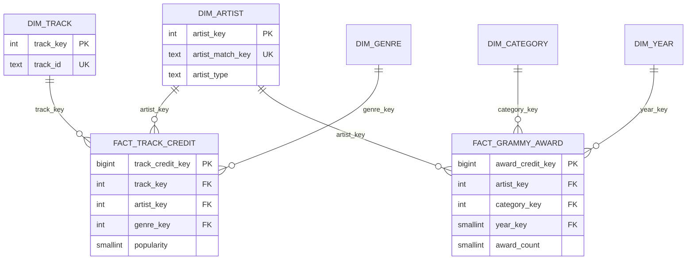
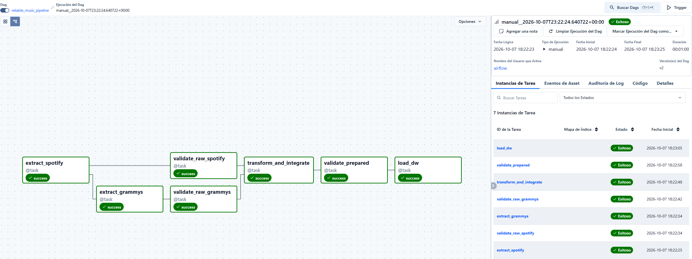
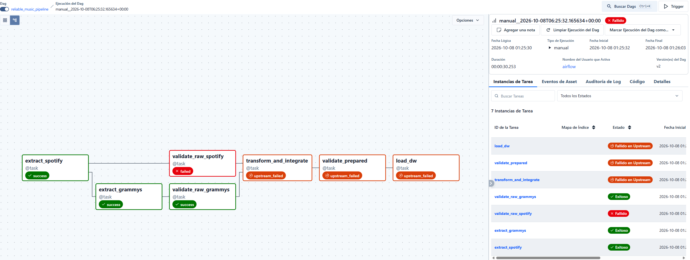
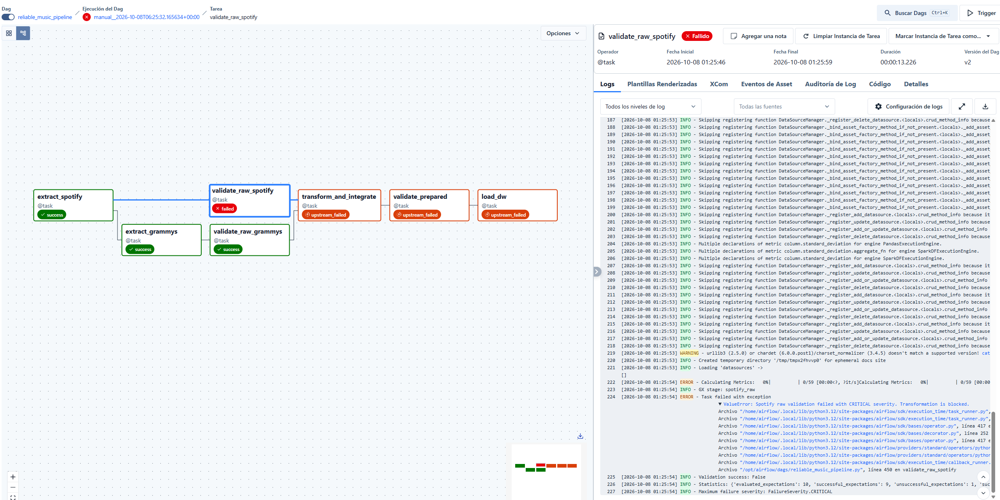

# Workshop 2: Building a Reliable Batch Data Pipeline

**Asignatura:** ETL - Ingeniería de Datos e Inteligencia Artificial (2026-2)  
**Institución:** Universidad Autónoma de Occidente (UAO)  
**Stack tecnológico:** Python 3.12, PostgreSQL 16, Apache Airflow 3.1.8, Great Expectations 1.23.x, Docker & Docker Compose.

---

## 1. Problema y Objetivo Analítico
El objetivo de este proyecto académico es diseñar y construir un pipeline de datos batch confiable, resiliente e idempotente. Este pipeline integra dos fuentes de datos heterogéneas (un archivo CSV del catálogo de Spotify y una base de datos relacional de los premios Grammy) para alimentar un Data Warehouse analítico con modelo en estrella en PostgreSQL (`music_dw`). La meta principal es responder a preguntas de negocio sobre la relación entre el reconocimiento en los premios Grammy y la popularidad o características acústicas de las pistas en Spotify.

## 2. Requerimientos Analíticos (R1, R2, R3)
El pipeline fue diseñado para soportar los siguientes requerimientos, los cuales demandan información combinada de ambas fuentes:

| ID | Requerimiento Analítico | Required Data (Atributo -> Fuente) | Fuentes de Datos | KPIs Esperados | Nivel de Detalle |
|---|---|---|---|---|---|
| **R1** | ¿Son los artistas con reconocimiento Grammy más populares en Spotify que los artistas sin este reconocimiento? | `artists`, `popularity`, `track_id` -> Spotify; `artist` -> Grammy | Spotify CSV + Grammy DB | **KPI-1a:** Popularidad promedio, artistas Grammy vs sin reconocimiento Grammy.<br>**KPI-1b:** % de pistas del catálogo por artistas Grammy. | Artista |
| **R2** | ¿Qué géneros concentran a los artistas Grammy y cómo difiere su perfil de audio del resto? | `track_genre`, `danceability`, `energy`, `valence`, `acousticness` -> Spotify; `artist` -> Grammy | Spotify CSV + Grammy DB | **KPI-2a:** Cantidad de artistas Grammy por género.<br>**KPI-2b:** Promedio de features de audio por género. | Género (y flag de Grammy) |
| **R3** | ¿Tienen los artistas con más premios Grammy una mayor presencia en Spotify y mayor popularidad? | `artist`, `category`, `year` -> Grammy; `track_id`, `popularity` -> Spotify | Spotify CSV + Grammy DB | **KPI-3a:** # premios, # categorías distintas, año del primer/último premio por artista.<br>**KPI-3b:** # de pistas y popularidad promedio por artista; Top 10. | Artista |

## 3. Fuentes de Datos
El proyecto integra información de dos orígenes con estructuras y tecnologías diferentes:

1. **Spotify Dataset (`data/raw/spotify_dataset.csv`):** Un archivo plano CSV con 114,000 filas (que corresponden a 89,741 pistas únicas). Contiene atributos de audio (`danceability`, `energy`, `valence`, `acousticness`), `popularity`, `artists` (delimitados por `;`) y `track_genre`.
2. **Grammy Awards Source DB (`grammy_source.public.grammy_awards`):** Una base de datos operacional PostgreSQL (puerto 5433 en host local / 5432 dentro del contenedor Docker). Cuenta con 4,810 registros históricos (1958–2019). **La extracción se realiza exclusivamente mediante consultas SQL a esta base de datos fuente**, nunca desde archivos intermedios.

## 4. Arquitectura del Pipeline

El pipeline de orquestación en Airflow sigue la siguiente arquitectura de dependencias. *(Nota: La extracción de grammys hereda el flujo de spotify para compartir metadatos como el `batch_id` sin abusar de XCom)*:

```text
       +-----------------------+              +------------------------------------+
       |  Spotify Tracks CSV   |              | Grammy Awards (PostgreSQL Source)  |
       |  (114,000 filas)      |              |       (4,810 registros)            |
       +-----------+-----------+              +-----------------+------------------+
                   |                                            |
                   v                                            v
         [ extract_spotify ] --------(batch_id)-------> [ extract_grammys ]
                   |                                            |
                   v                                            v
         ( spotify_raw.parquet )                      ( grammy_raw.parquet )
                   |                                            |
                   v                                            v
       [ validate_raw_spotify ]                     [ validate_raw_grammys ]
       (Great Expectations Gate)                    (Great Expectations Gate)
                   \                                            /
                    \                                          /
                     v                                        v
                 +-----------------------------------------------+
                 |            transform_and_integrate           |
                 |      (Limpieza, Split N:M, Normalización,     |
                 |       Miembros Especiales, Reconciliación)   |
                 +-----------------------+-----------------------+
                                         |
                                         v
                         ( 4 Datasets Preparados Parquet )
                                         |
                                         v
                            [ validate_prepared ]
                          (Great Expectations Gate)
                                         |
                                         v
                                  [ load_dw ]
                     (Safe Rerun: UPSERT dims + Truncate-and-Load facts)
                                         |
                                         v
                 +-----------------------------------------------+
                 |       PostgreSQL Data Warehouse (music_dw)    |
                 |            Esquema Estrella ('dw')            |
                 |      Dimensiones + Hechos + Vistas KPI        |
                 +-----------------------------------------------+

```

### 4.1 Estructura del Repositorio

```text
ETL_2026-2_Workshop-2/
├── dags/
│   └── reliable_music_pipeline.py    # DAG de Airflow 3.1.8 (TaskFlow API, gates, reintentos)
├── data/
│   ├── raw/
│   │   ├── spotify_dataset.csv       # Archivo crudo fuente de Spotify
│   │   └── the_grammy_awards.csv     # CSV original usado para inicializar la BD relacional
│   └── staging/                      # Parquet por lote intercambiado (ignorado en git)
├── docs/
│   ├── evidence/                     # Evidencias generadas (profiling, transform, validation)
│   ├── quality_rules.md              # Catálogo formal de reglas DQ01-DQ20
│   ├── requirements.md               # Definición formal de alcance analítico y requerimientos
│   └── transformation_decisions.md   # Registro de decisiones de ingeniería T1-T13
├── sql/
│   ├── dw_schema.sql                 # DDL del modelo estrella en PostgreSQL
│   ├── kpi_queries.sql               # Vistas SQL analíticas para KPIs de R1, R2 y R3
│   └── source_setup.sql              # DDL de la BD operacional de origen de Grammy
├── src/
│   ├── config.py                     # Configuración de rutas y conexiones DB
│   ├── controlled_failure.py         # Generador de datos corruptos para Test B
│   ├── extract.py                    # Extracción desacoplada hacia staging Parquet
│   ├── load.py                       # Carga a DW (UPSERT y Truncate-and-Load)
│   ├── load_grammy_source.py         # Inicialización de la BD fuente operacional
│   ├── run_local_pipeline.py         # Ejecución local de punta a punta
│   ├── run_validation_checks.py      # Pruebas de validación cruda
│   ├── transform.py                  # Transformación, integración y reconciliación
│   └── validation.py                 # Suites Great Expectations y checkpoints
└── requirements.txt                  # Dependencias del proyecto

```

## 5. Hallazgos del Perfilamiento de Datos

A través del análisis descriptivo (`notebooks/data_profiling.ipynb`), se identificaron los siguientes riesgos (RK) para la calidad e integración:

* **(RK07) Duplicados:** 450 filas duplicadas idénticas en Spotify.
* **(RK15) Valores anómalos:** El 14% de las filas en Spotify presentan popularidad `0`. Su significado real de negocio no está establecido formalmente en los metadatos de la plataforma.
* **(RK14) Granularidad anidada:** El 26% de las filas de Spotify agrupan artistas delimitados por `;`.
* **(RK05) Datos faltantes (Grammy):** 38% (1,840 filas) de los registros de premios Grammy no tienen artista asignado (ej. premios técnicos).
* **(RK23) Colaboraciones (Grammy):** Solo el 7% de las colaboraciones coinciden directamente con Spotify sin requerir separación de los strings.
* **(RK25 / RK26) Créditos genéricos y formato:** Se identificaron nombres con paréntesis; la gran mayoría son artistas reales (ej. "(The Beatles)"), pero existen 69 filas con valores verdaderamente genéricos como "Various Artists" o "Original Cast" que distorsionan los rankings.
* **(RK22) Ausencia de clave primaria compartida:** Las dos fuentes solo pueden conectarse mediante una normalización exhaustiva del nombre del artista.
* **(RK11) Columna constante:** La columna `winner` de los Grammy es siempre `True` en las 4,810 filas.

## 6. Riesgos y Reglas de Calidad

| Regla ID | Dimensión | Descripción de la Regla | Severidad |
| --- | --- | --- | --- |
| **DQ01-02** | Validez/Complet. | Schema válido en Spotify y `track_id` no nulo (100%). | Critical |
| **DQ03** | Validez | `popularity` está estrictamente entre 0 y 100. | Critical |
| **DQ04** | Validez | Los cuatro *audio features* de R2 están entre 0 y 1. | Critical |
| **DQ05** | Completitud | `artists` no es nulo (tolerancia >= 99.9%). | Warning |
| **DQ06** | Unicidad | Un par (`track_id`, `track_genre`) aparece una vez (tol >= 99%). | Warning |
| **DQ07** | Monitor | Alerta si las filas con popularidad 0 superan el 20%. | Informational |
| **DQ08-11** | Validez/Complet. | Schema Grammy válido, `source_row_id` único, años válidos. | Critical |
| **DQ12** | Validez | La columna `winner` es siempre `True` (100%). | Critical |
| **DQ13** | Completitud | Artista presente en la fuente Grammy (>= 50%). | Warning |
| **DQ14-16** | Unicidad | Llaves únicas en dimensiones y respeto de granos de hechos. | Critical |
| **DQ17** | Validez | Clave de artista no nula, tipo válido (`REAL`, `PLACEHOLDER`, `UNKNOWN`). | Critical |
| **DQ18** | Validez | Medidas no nulas en fact, `popularity` en 0-100, features 0-1. | Critical |
| **DQ19** | Integración | Existe un traslape mínimo (>= 30 artistas presentes en ambas fuentes). | Critical |
| **DQ20** | Integración | Proporción razonable (>= 33%) de artistas Grammy en Spotify. | Warning |

## 7. Diseño de Validación (Great Expectations)

El control automatizado se realiza en dos etapas (Raw y Prepared) usando **Great Expectations**:

* **Diseño:** Los DataFrames se evalúan mediante un `Expectation Suite` a través de un `Validation Definition` ejecutado por un `Checkpoint`.
* **Política de severidad:** Fallas de nivel **Critical** (ej. DQ03) lanzan un `DataQualityError` que detiene (`STOP`) el pipeline. Fallas **Warning** (ej. DQ06) y **Informational** (ej. DQ07) registran sus alertas (`CONTINUE WITH WARNING/INFO`) en el JSON de resultados, permitiendo observar tendencias sin romper la carga.

## 8. Estrategia de Transformación e Integración

La fase `transform_and_integrate` asienta el contrato de integración:

* **T3 y T6 (Deduplicación):** Se remueven los 450 duplicados de Spotify y se fuerza el grano estricto de *(track, artista, género)*.
* **T5 y T7 (Split):** *Explode* del campo `artists` de Spotify por `;`. Las colaboraciones de Grammy se dividen *solo* si los nombres individuales tienen evidencia previa en el catálogo de Spotify.
* **T8 (Miembros Especiales):** Los premios sin artista se mapean a `__unknown__` (clave `-1`); los 69 registros de actos genéricos ("Various Artists") se mapean a `__placeholder__` (clave `-2`) excluyéndolos de los cálculos de artista.
* **T9 (Contrato de Integración):** Integración generada mediante clave **NFKD** (minúsculas, sin acentos ni signos).
* **T12:** Preservación de la popularidad `0`. No se imputan datos inventados; la vista SQL decide si excluirlos.
* **T13:** Se elimina el campo redundante `winner` (siempre `True`).

## 9. Modelo Dimensional (Star Schema)

El Data Warehouse (`music_dw.dw`) modela dos procesos (catálogo y premios) compartiendo la dimensión confluente `dim_artist`.



## 10. Diseño del DAG (Airflow)

El DAG `reliable_music_pipeline` utiliza TaskFlow API:

1. `extract_spotify` (lee CSV).
2. `extract_grammys` (extrae de BD origen, tras heredar `batch_id`).
3. `validate_raw_spotify` y `validate_raw_grammys` evalúan la data cruda.
4. `transform_and_integrate` limpia e integra ambos orígenes.
5. `validate_prepared` certifica que el producto final no rompe el modelo.
6. `load_dw` inserta de manera segura en PostgreSQL.

## 11. Política de Fallos y Reintentos

| Condición (Tipo de Falla) | Severidad | Respuesta del Pipeline | ¿Reintento? | Justificación |
| --- | --- | --- | --- | --- |
| **Problemas Transitorios de Red/BD** | Alta | Falla `extract_grammys` o `load_dw` (interacción externa). | **Sí (`retries=2`, `retry_delay=3m`)** | Caídas temporales de la base de datos o latencia de red pueden superarse tras unos minutos sin cambiar el código ni la data. |
| **Regla DQ Fallida (Deterministic)** | Critical | Tarea `validate_*` lanza error y bloquea el DAG aguas abajo. | **No (`retries=0`)** | Una falla de esquema o valores atípicos es determinística; no pasará mágicamente al reintentar sin arreglar el origen. |


## 12. Evidencia de Ejecución Exitosa (Test A)

El pipeline ha demostrado orquestar exitosamente datos limpios hacia el entorno `music_dw`. Como se observa en la siguiente captura, las 7 tareas configuradas en la vista Graph/Grid finalizaron en estado **success** (verde), indicando que las validaciones de Great Expectations pasaron sin reglas Críticas fallidas, y la carga dimensional se completó transaccionalmente:



### 12.1 Registro de Evidencias (Reliability Evidence Register)

| ID Evidencia | Ejecución / Tarea | Artefacto o Ruta | Qué demuestra | Related Policy / Rule |
| --- | --- | --- | --- | --- |
| **E-01** | `validate_raw_*` | `docs/evidence/validation/A_baseline/` | Aprobación de Quality Gates en ejecución exitosa. | `Critical Policy` |
| **E-02** | `validate_raw_spotify` | `docs/evidence/airflow/test_b_failure.png` | Bloqueo efectivo del DAG ante reglas críticas (Test B). | `DQ03: Critical` |
| **E-03** | `transform_integrate` | `docs/evidence/transform/*/reconciliation.json` | Invariantes de transformación e integridad mantenidos. | N/A (Transformation invariant) |
| **E-04** | Orquestador | `docs/evidence/airflow/test_a_success.png` | Orquestación correcta y estado de red. | `DAG Flow Policy` |
| **E-05** | `load_dw` | `docs/evidence/rerun/rerun_comparison.md` | Idempotencia y repetibilidad segura (Safe Rerun). | N/A (Idempotency invariant) |


## 13. Evidencia de Falla Controlada (Test B)

Al inyectar intencionalmente una pista con `popularity = 150` (violando DQ03) en `spotify_bad.csv`, la tarea `validate_raw_spotify` cambia a estado **failed** (rojo) y bloquea la propagación de datos corruptos al DW (**upstream_failed** naranja). Esta captura demuestra la efectividad de la política de severidad que protege al modelo dimensional:





* Log de falla y reglas de GX documentadas en `docs/evidence/validation/`.

## 14. Estrategia de Repetibilidad (Safe Rerun)

La operación `load_dw` es estrictamente idempotente para evitar silenciosos duplicados de datos:

1. **Dimensiones (`dim_artist`, `dim_track`, `dim_genre`, `dim_category`, `dim_year`):** Se cargan mediante `UPSERT` (`INSERT ... ON CONFLICT (business_key) DO UPDATE`).
2. **Tablas de Hechos (`fact_track_credit`, `fact_grammy_award`):** Utilizan el patrón `Truncate-and-Load`. Ambas operaciones de eliminación e inserción masiva ocurren dentro de un bloque **transaccional atómico** (`BEGIN ... COMMIT`).

* *Respuesta ante fallo:* Si una inserción en las tablas de hechos falla a la mitad, PostgreSQL emite un `ROLLBACK`, lo que revierte el *truncate* y deja el Data Warehouse intacto con la data del lote anterior.

## 15. Dashboard y Salidas Analíticas

Resultados extraídos directamente del Data Warehouse mediante las vistas en `sql/kpi_queries.sql` :

* **R1 (Popularidad):**
* *Lectura incluyendo ceros:* 32.84 (Grammy) vs 33.49 (Sin presencia Grammy). La proporción de pistas con popularidad 0 es muy alta en el grupo premiado (24.37%) frente al otro (9.77%).
* *Lectura excluyendo ceros - reproducción real:* Los artistas Grammy promedian **43.42** de popularidad frente a **37.11** del resto.
* *Catálogo:* El 9.36% de las pistas únicas cuenta con la participación de un artista galardonado.


* **R2 (Géneros):** Rock, Country y Soul lideran la concentración histórica.
* **R3 (Ranking):** El Top 10 histórico está encabezado por Aretha Franklin, Ray Charles, U2 y Tony Bennett (18 premios cada uno), siendo Beyoncé la que exhibe la popularidad media más alta en Spotify (72.83).

### 15.1 Visualizaciones Planeadas en Power BI

| ID | Req. | Salida Visual Planeada |
| --- | --- | --- |
| **V-1** | R1 | Gráfico de barras (Popularidad media excl/incl. ceros) y Tarjeta (% catálogo). |
| **V-2** | R2 | Mapa de calor / Barras apiladas cruzando los 5 géneros top con sus *audio features*. |
| **V-3** | R3 | Tabla de Top 10 y un diagrama de dispersión cruzando # de Premios vs Popularidad Promedio. |

### 15.2 Matriz de Trazabilidad End-to-End

| Req. | Riesgo Calidad | Regla DQ | Expectation GX | Transformación (Decisión) | Elemento en DW | KPI |
| --- | --- | --- | --- | --- | --- | --- |
| **R1** | RK07 (duplicados) | **DQ06** (unicidad track-genre) | `ExpectCompoundColumnsToBeUnique` | **T3:** Eliminación de 450 filas duplicadas. | `dw.dim_track` | KPI-1a |
| **R1** | RK15 (14% pop 0) | **DQ03** (dominio), **DQ07** | `ExpectColumnValuesToBeBetween` | **T12:** Ceros conservados, excluidos en la vista. | `dw.fact_track_credit` | KPI-1a |
| **R2** | RK13 (género por fila) | **DQ15** (grano de créditos) | `ExpectCompoundColumnsToBeUnique` | **T6:** Deduplicación al grano estricto. | `dw.dim_genre` | KPI-2a, 2b |
| **R3** | RK10 (Grammy sin PK) | **DQ09** (unicidad) | `ExpectColumnValuesToBeUnique` | Uso de `source_row_id` como clave degenerada. | `dw.fact_grammy_award` | KPI-3a |
| **R3** | RK05 (38% sin artista) | **DQ13**, **DQ17** | `ExpectColumnValuesToNotBeNull` | **T8:** Mapeo a miembro `__unknown__` (`-1`). | `dw.dim_artist` | KPI-3a |
| **R3** | RK25 (actos genéricos) | **DQ17** (artist_type) | `ExpectColumnValuesToBeInSet` | **T8:** Mapeo a `__placeholder__` (`-2`). | `dw.dim_artist` | KPI-3b |

## 16. Instrucciones de Instalación y Ejecución

**1. Entorno (`.env`) en la raíz:**

```env
ANALYTICS_PG_HOST_PORT=5433
ANALYTICS_PG_USER=etl_user
ANALYTICS_PG_PASSWORD=etl_password

```

**2. Ejecución Local:**

```bash
python -m venv venv
source venv/bin/activate  # (En Windows: .\venv\Scripts\Activate.ps1)
pip install -r requirements.txt

# Inicializar origen relacional
python src/load_grammy_source.py

# Crear esquema DW estrella y Vistas
python -c "from src import config; import psycopg2; conn = psycopg2.connect(**config.pg_params('music_dw')); cur = conn.cursor(); cur.execute((config.SQL_DIR / 'dw_schema.sql').read_text(encoding='utf-8')); cur.execute((config.SQL_DIR / 'kpi_queries.sql').read_text(encoding='utf-8')); conn.commit(); conn.close(); print('DW Creado')"

# Pipeline local
python -m src.run_local_pipeline

```

**3. Orquestación con Docker Compose (Airflow 3.1.8):**

```bash
docker compose build
docker compose up airflow-init
docker compose up -d

```

Acceder a `http://localhost:8080`, habilitar `reliable_music_pipeline` y presionar **Trigger DAG**.

## 17. Supuestos y Limitaciones

* **Integración por string:** Al carecer de un ID relacional, el puente asume que artistas con el mismo nombre normalizado (NFKD) son la misma persona. Homónimos causarán traslapes de métricas.
* **El significado del 0:** En el perfilamiento se detectó que el 14% de las pistas tiene `popularity = 0` (RK15). El metadato oficial de Spotify no establece si esto significa una falta total de reproducciones o temas de archivo descontinuados. Se asumió matemáticamente excluir este segmento de las medias comparativas para evitar sesgar a la baja las tendencias.
* **Muestra asimétrica temporal:** Spotify no cuenta con fecha de publicación de la pista, impidiendo medir el impacto de la popularidad en relación a un "antes o después" de ganar el premio Grammy.
