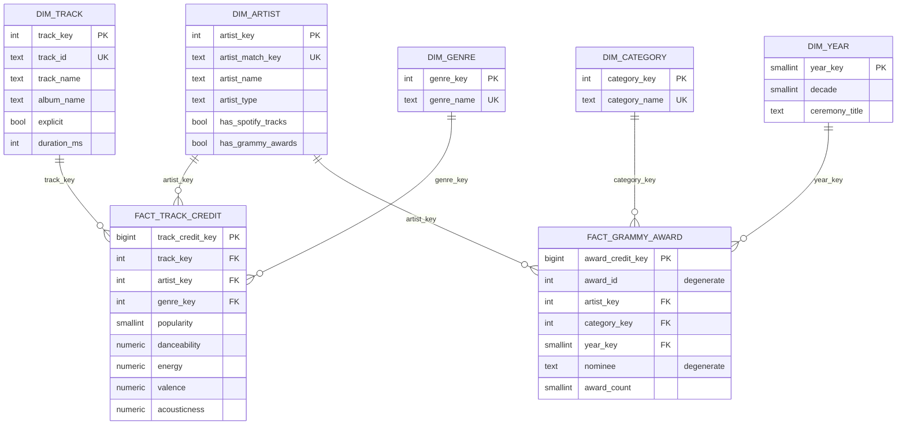

# Dimensional Model Design (6.4)

Executable definition: `sql/dw_schema.sql` (tables) and `sql/kpi_queries.sql` (KPI views). Target: PostgreSQL database `music_dw`, schema `dw`.
Risk IDs (`RKxx`) refer to `docs/evidence/profiling/risk_register.md`; requirement IDs to `docs/requirements.md`.

## 1. Star schema (fact constellation)

## 2. Design decisions

| Design decision | Required content |
|---|---|
| **Business process** | (1) *Spotify catalog*: an artist is credited on a track listed in a genre. (2) *Grammy awards*: an award is granted to an artist in a category in a ceremony year. Both are linked only through the artist. |
| **Grain: `fact_track_credit`** | One row per distinct **(track, artist, genre)**. |
| **Grain: `fact_grammy_award`** | One row per **(award entry, credited artist)**. An award entry is one row of `grammy_awards` (identified by `award_id`); one entry credited to two artists becomes two rows. |
| **Dimensions** | `dim_artist` (conformed), `dim_track`, `dim_genre`, `dim_category`, `dim_year`. |
| **Measures** | `fact_track_credit`: `popularity`, `danceability`, `energy`, `valence`, `acousticness` (non-additive: averaged, never summed). `fact_grammy_award`: `award_count` (additive, always 1). Counts of tracks and artists are `COUNT(DISTINCT ...)`. |
| **Keys** | Integer surrogate keys (identity) on every dimension except `dim_year` (natural key: the year). Business keys have `UNIQUE`: `artist_match_key`, `track_id`, `genre_name`, `category_name`. Each fact has a surrogate PK plus a `UNIQUE` constraint on its grain, which blocks duplicate rows on a rerun. |
| **Relationships** | Every fact FK is `NOT NULL` and references its dimension. Grammy rows without artist point to the unknown member `artist_key = -1`, so the FK is never null. |

## 3. Why the model looks like this (traceability to profiling)

| Evidence | Decision |
|---|---|
| RK07: 24,259 rows repeat a `track_id`; 16,299 tracks sit in several genres; 450 exact duplicates | Grain is (track, artist, genre) and exact duplicates are removed before loading; `UNIQUE` on the grain. |
| RK08: 720 tracks have different popularity per genre | The fact keeps each row's own popularity (no information lost). Track-level averages are defined once, in `vw_artist_track`. |
| RK14: 26% of Spotify rows list several artists | Artists are split in the transformation; each credit is one fact row, so no bridge table is needed. |
| RK23: 7% of Grammy collaborations match vs 56% of single artists | Grammy artist strings are split into credits as well; the award grain is therefore (award, artist). |
| RK24: matched artists have up to 332 tracks and 18 awards each (66 when generic credits are counted); many-to-many | **Two facts**, never joined to each other. They meet only through `dim_artist`, and each KPI aggregates each fact separately (drill-across). Joining them directly would multiply awards. |
| RK05: 38% of Grammy rows have no artist | Unknown member `-1`: the award is kept and counted in reconciliation, but excluded from artist KPIs. |
| RK25 / RK26: generic credits such as "(Various Artists)" (69 rows); other parenthesized values are real acts | Two fixed special members: `-1` UNKNOWN (no artist in source) and `-2` PLACEHOLDER (generic credits). Both are excluded from artist KPIs (`artist_type = 'REAL'` only). Parentheses are stripped from display names; the matching key already ignores them. |
| RK11: `winner` is `True` in all rows | No `winner` column in the DW; the measure is `award_count`. No win rate. |
| RK12: 638 categories, 224 used once | `dim_category` is a flat dimension keyed by name; no category hierarchy is invented. |
| RK21: Spotify has no date | No date dimension on the Spotify fact. `dim_year` belongs to Grammy only. |
| Requirements-driven scope | Only the audio features R2 needs are loaded; `tempo`, `loudness`, `key`... are left out on purpose. |

## 4. How each requirement is supported

| Requirement | Facts and dimensions | Query / view | KPI / visualization |
|---|---|---|---|
| R1 | `fact_track_credit` + `dim_artist.has_grammy_awards` (set from `fact_grammy_award`) | `vw_kpi_1a_popularity_by_grammy`, `vw_kpi_1b_catalog_share` | KPI-1a, KPI-1b, V-1 |
| R2 | `fact_track_credit` + `dim_genre` + `dim_artist` | `vw_kpi_2a_grammy_artists_by_genre`, `vw_kpi_2b_audio_profile` | KPI-2a, KPI-2b, V-2 |
| R3 | `fact_grammy_award` + `dim_category` + `dim_year`; `fact_track_credit` through `vw_artist_track` | `vw_kpi_3_artist_ranking` | KPI-3a, KPI-3b, V-3 |

The views were tested on a scratch database with synthetic rows: the track-level popularity average, the exclusion of placeholder and unknown artists, and the rejection of a duplicate grain row all behave as designed.

## 5. Approved decisions (applied in 6.8 and 6.10)

These were proposed in the model review and approved:

1. **Artist names:** collaborators are split in the ETL (Spotify `;`, Grammy `&`, `Featuring`, `,`); names are standardized in `dim_artist` (normalized match key, one display name per key).
2. **`popularity = 0`:** stays in the facts; the KPI views filter it (headline metric excludes zeros and the zero share is reported alongside).
3. **Generic credits:** values such as "(Various Artists)" map to the special member `-2` PLACEHOLDER; missing artists map to `-1` UNKNOWN. The approved rule was refined after checking the data: most parenthesized Grammy values are real acts ("(Miles Davis)", "(The Beatles)"), so only generic credits (`GENERIC_CREDITS` list) become placeholders.
4. **Rerun strategy:** dimensions are loaded with upsert on the business key; facts use transactional truncate-and-load; the grain `UNIQUE` constraints are the safety net.

Still to confirm in 6.8: the single Spotify row without artist (proposal: map to `-1`) and the row with `duration_ms = 0` (proposal: load as NULL).
`has_spotify_tracks` / `has_grammy_awards` are derived in `transform_and_integrate` and checked in `validate_prepared` (DQ14-DQ20).

## 6. Limitations

- Integration is by artist name, not by id: homonyms can be joined and spelling variants can be missed (Integration Contract, 6.8).
- Averages over the Spotify fact describe the Spotify sample, not the whole catalog.
- A track listed under a Grammy and a non-Grammy artist counts in both groups of KPI-1a and KPI-2b by design (the comparison is by artist).